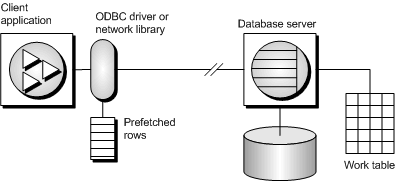

<!-- loio3bd6e7386c5f1014b58696881ededb9c -->

# Catalog Store Cursor Sensitivity and Performance in Data Lake Relational Engine 

There is a trade-off between performance and other cursor properties. In particular, making a cursor updatable places restrictions on the cursor query processing and delivery that constrain performance. Also, putting requirements on cursor sensitivity may constrain cursor performance.

To understand how the updatability and sensitivity of cursors affects performance, you must understand how the results that are visible through a cursor are transmitted from the database to the client application.

In particular, results may be stored at two intermediate locations for performance reasons:

Work tables
:   Either intermediate or final results may be stored as work tables. Value-sensitive cursors employ a work table of primary key values. Query characteristics may also lead the optimizer to use work tables in its chosen execution plan.

Prefetching
:   The client side of the communication may retrieve rows into a buffer on the client side to avoid separate requests to the database server for each row.

Sensitivity and updatability limit the use of intermediate locations.

