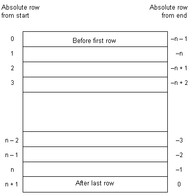

<!-- loio3be3fe076c5f1014bcf4c886496f0bcb -->

# Cursors

A **cursor** is a name associated with a result set. The result set is obtained from a SELECT statement or stored procedure call.

A cursor is a handle on the result set. At any time, the cursor has a well-defined position within the result set. With a cursor, you can examine and possibly manipulate the data one row at a time. With a cursor, you can move forward and backward through the query results.

## Cursor Positions

Cursors can be positioned in the following places:

-   Before the first row of the result set.

-   On a row in the result set.

-   After the last row of the result set.

The cursor position and result set are maintained in the database server. Rows are **fetched** by the client for display and processing either one at a time or a few at a time. The entire result set does not need to be delivered to the client.

