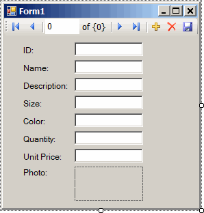
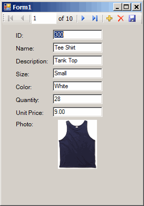

<!-- loio3bd79ce06c5f1014b4b0cb1db8849f0b -->

# Lesson 1: Creating a Table Viewer

Use Microsoft Visual Studio, the Server Explorer, and the SQL Anywhere .NET Data Provider to create an application that accesses one of the tables in the sample database, allowing you to examine rows and perform updates.

## Prerequisites

You must have Microsoft Visual Studio and the .NET Framework installed on your computer.

You must have the roles and privileges listed at the beginning of this tutorial.

## Context

This tutorial is based on Microsoft Visual Studio and the .NET Framework. The complete application can be examined by opening the project <code><i>%IQDIRSAMP17%</i></code>.

## Procedure

1.  Start Microsoft Visual Studio.

2.  Click *File* \> *New* \> *Project*.

    The *New Project* window appears.

    1.  In the left pane of the *New Project* window, click either *Visual Basic* or *Visual C\#* for the programming language.

    2.  From the *Windows* subcategory, click *Windows Application* \(VS 2005\) or *Windows Forms Application* \(VS 2008 or later\).

    3.  Select the .NET Framework version corresponding to the SQL Anywhere .NET Data Provider installed. For example, select *.NET Framework 4.5* from the dropdown list if the version you have installed is 4.5.

    4.  In the project *Name* field, type ***MySimpleViewer***.

    5.  Click *OK* to create the new project.

3.  Click *View* \> *Server Explorer*.

4.  In the *Server Explorer* window, right-click *Data Connections* and click *Add Connection*.

5.  In the *Add Connection* window:

    1.  If you have used *Add Connection* before, then click *Change* to change the data source.

    2.  You see a list of data sources. Select *NET Framework Data Provider for *SAP IQ* *17** from the list of data sources presented and click *OK*.

    3.  Under *Data source*, click *ODBC data source* and select or type ****SAP IQ 17 Demo****.

    4.  Under *Login information*, in the *Password* field, enter the sample database password \(*sql*\).

    5.  Click *Test Connection* to verify that you can connect to the sample database.

    6.  Click *OK*.

    A new connection named **SQL Anywhere*.*iqdemo**17** appears in the *Server Explorer* window.

6.  Expand the **SQL Anywhere*.*iqdemo**17** connection in the *Server Explorer* window until you see the table names.

    \(Microsoft Visual Studio 2005 only\) Try the following:

    1.  Right-click the Products table and click *Show Table Data*.

        This shows the rows and columns of the Products table in a window.

    2.  Close the table data window.

7.  Click *Data* \> *Add New Data Source*. For later versions of Microsoft Visual Studio, this is *Project* \> *Add New Data Source*.

8.  In the *Data Source Configuration Wizard*, do the following:

    1.  On the *Data Source Type* page, click *Database*, then click *Next*.

    2.  \(Microsoft Visual Studio 2010 or later\) On the *Database Model* page, click *Dataset*, then click *Next*.

    3.  On the *Data Connection* page, click **SQL Anywhere*.*iqdemo* *17**, click *Yes, include sensitive data in the connection string*, then click *Next*.

    4.  On the *Save the Connection String* page, make sure that *Yes, save the connection as* is chosen and click *Next*.

    5.  On the *Choose Your Database Objects* page, click *Tables*, then click *Finish*.

9.  Click *Data* \> *Show Data Sources*. For later versions of Microsoft Visual Studio, this might be *View* \> *Other Windows* \> *Data Sources*.

    The *Data Sources* window appears.

    Expand the Products table in the *Data Sources* window.

    1.  Click *Products*, then click *Details* from the dropdown list.

    2.  Click *Photo*, then click *Picture Box* from the dropdown list.

    3.  Click *Products* and drag it to your form \(Form1\).

    

    A dataset control and several labeled text fields appear on the form.

10. On the form, click the picture box next to Photo.

    1.  Change the shape of the box to a square.

    2.  Click the right-arrow in the upper-right corner of the picture box.

        The *Picture Box Tasks* window opens.

    3.  From the *Size Mode* dropdown list, click *Zoom*.

    4.  To close the *Picture Box Tasks* window, click anywhere outside the window.

11. Build and run the project.

    1.  Click *Build* \> *Build Solution*.

    2.  Click *Debug* \> *Start Debugging*.

        The application connects to the sample database and displays the first row of the Products table in the text boxes and picture box.

        

    3.  You can use the buttons on the control to scroll through the rows of the result set.

    4.  You can go directly to a row in the result set by entering the row number in the scroll control.

    5.  You can update values in the result set using the text boxes and save them by clicking the *Save Data* button.

12. Shut down the application and then save your project.

## Results

You have now created a simple, yet powerful, Microsoft .NET application using Microsoft Visual Studio, the Server Explorer, and the SQL Anywhere .NET Data Provider.

## Next Steps

Proceed to the next lesson, where you add a datagrid control to the form developed in this lesson.

