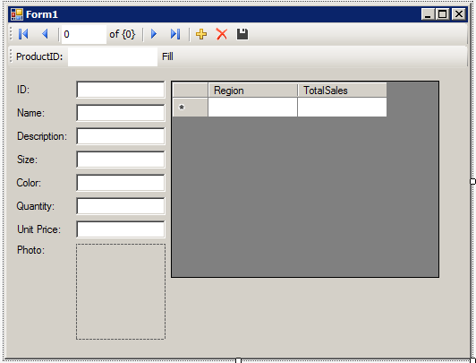
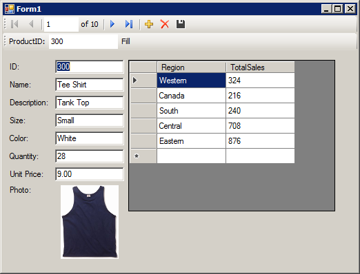
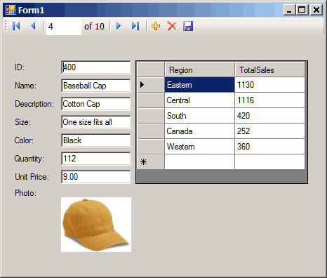

<!-- loio3bd7a4cd6c5f1014b313c347a66608b6 -->

# Lesson 2: Adding a Synchronizing Data Control

Add a datagrid control to the form developed in the previous lesson.


## Prerequisites

You must have completed the previous lessons in this tutorial.

You must have the roles and privileges listed at the beginning of this tutorial.


## Context

This control updates automatically as you navigate through the result set.

The complete application can be examined by opening the project <code><i>%IQDIRSAMP17%</i>\SQLAnywhere\ADO.NET\SimpleViewer\SimpleViewer.sln</code>.


## Procedure

1.  Start Microsoft Visual Studio and load your MySimpleViewer project.

2.  Right-click *DataSet1* in the *Data Sources* window and click *Edit DataSet with Designer*.

3.  Right-click an empty area in the *DataSet Designer* window and click *Add* \> *TableAdapter*.

4.  In the *TableAdapter Configuration Wizard*:

    1.  On the *Choose Your Data Connection* page, click *Next*.

    2.  On the *Choose A Command Type* page, click *Use SQL statements*, then click *Next*.

    3.  On the *Enter a SQL Statement* page, click *Query Builder*.

    4.  On the *Add Table* window, click the *Views* tab, then click *ViewSalesOrders*, and then click *Add*.

    5.  Click *Close* to close the *Add Table* window.


5.  Expand the *Query Builder* window so that all sections of the window are visible.

    1.  Expand the *ViewSalesOrders* window so that all the checkboxes are visible.

    2.  Click *Region*.

    3.  Click *Quantity*.

    4.  Click *ProductID*.

    5.  In the grid below the *ViewSalesOrders* window, clear the checkbox under *Output* for the ProductID column.

    6.  For the ProductID column, type a question mark \(?\) in the *Filter* cell and then click anywhere else on the form. This generates a WHERE clause for ProductID.


    A SQL query has been built that looks like the following:

    ```
    SELECT   Region, Quantity
    FROM     GROUPO.ViewSalesOrders
    WHERE    (ProductID = :Param1)
    ```

6.  Modify the SQL query as follows:

    1.  Change `Quantity` to `SUM(Quantity) AS TotalSales`.

    2.  Add `GROUP BY Region` to the end of the query following the WHERE clause.


    The modified SQL query now looks like this:

    ```
    SELECT   Region, SUM(Quantity) as TotalSales
    FROM     GROUPO.ViewSalesOrders
    WHERE    (ProductID = :Param1)
    GROUP BY Region
    ```

7.  Click *OK*.

8.  Click *Finish*.

    A new *TableAdapter* called *ViewSalesOrders* has been added to the *DataSet Designer* window.

9.  Click the form design tab \(Form1.cs \[Design\]\).

    -   Stretch the form to the right to make room for a new control.


10. Expand ViewSalesOrders in the *Data Sources* window.

    1.  Click *ViewSalesOrders* and click *DataGridView* from the dropdown list.

    2.  Click *ViewSalesOrders* and drag it to your form \(Form1\).


    

    A datagrid view control appears on the form.

11. Build and run the project.

    -   Click *Build* \> *Build Solution*.

    -   Click *Debug* \> *Start Debugging*.

    -   In the *Param1* or *ProductID* \(Microsoft Visual Studio 2010 or later\) text box, enter a product ID number such as 300 and click *Fill*.


    The datagrid view displays a summary of sales by region for the product ID entered.

    

    You can also use the other control on the form to move through the rows of the result set.

    It would be ideal, however, if both controls could stay synchronized with each other. The next few steps show how to do this.

12. Shut down the application and then save your project.

13. Delete the Fill strip on the form since you do not need it.

    -   On the design form \(Form1\), right-click the Fill strip to the right of the word *Fill*, then click *Delete*.


    The Fill strip is removed from the form.

14. Synchronize the two controls as follows.

    1.  On the design form \(Form1\), right-click the ID text box, then click *Properties*.

    2.  Click the *Events* button \(it appears as a lightning bolt\).

    3.  Scroll down until you find the *TextChanged* event.

    4.  Click *TextChanged*, then click *fillToolStripButton\_Click* from the dropdown list. If you are using Microsoft Visual Basic, the event is called *FillToolStripButton\_Click*.

    5.  Double-click *fillToolStripButton\_Click* and the form's code window opens on the `fillToolStripButton_Click` event handler.

    6.  Find the reference to `param1ToolStripTextBox` or `productIDToolStripTextBox` \(Microsoft Visual Studio 2010\) and change this to `iDTextBox`. If you are using Microsoft Visual Basic, the text box is called `IDTextBox`.

    7.  Rebuild and run the project.


15. The application form now appears with a single navigation control.

    -   The datagrid view displays an updated summary of sales by region corresponding to the current product as you move through the result set.

        


16. Shut down the application and then save your project.


## Results

You have now added a control that updates automatically as you navigate through the result set.

In this tutorial, you saw how the powerful combination of Microsoft Visual Studio, the Server Explorer, and the SQL Anywhere .NET Data Provider can be used to create database applications.

