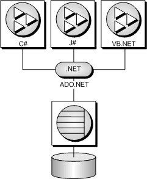

<!-- loio3bcf7ea46c5f1014a9829e9a9b4a84a0 -->

# SQL Anywhere .NET Data Provider

Microsoft ADO.NET is the latest data access API in the line of ODBC, OLE DB, and ADO. It is the preferred data access component for the Microsoft .NET Framework and allows you to access relational database systems.

The SQL Anywhere .NET Data Provider implements the Sap.Data.SQLAnywhere namespace and allows you to write programs in any of the .NET supported languages, such as Microsoft C\# and Microsoft Visual Basic .NET, and access data from data lake Relational Engine databases.

## Microsoft ADO.NET Applications

You can develop Internet and intranet applications using object-oriented languages, and then connect these applications to the database server using the SQL Anywhere.NET Data Provider.

