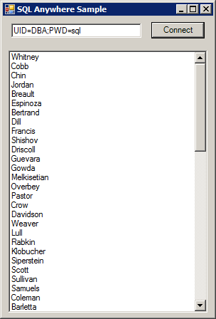

<!-- loio3bcf86fb6c5f1014aa3e9f9c47ff2486 -->

# Tutorial: Using the Simple Code Sample in SimpleWin32

Use the Simple project as an example of how to obtain a result set from the database server using the .NET Data Provider.


## Prerequisites

You must have the SELECT ANY TABLE system privilege.


## Context

The Simple project is included with the samples. It demonstrates a simple listbox that is filled with the names from the Employees table. You must have Microsoft Visual Studio and the Microsoft .NET Framework installed on your computer.


## Procedure

1.  Start Microsoft Visual Studio.

2.  Click *File* \> *Open* \> *Project*.

3.  Browse to <code><i>%IQDIRSAMP17%</i>\SQLAnywhere\ADO.NET\SimpleWin32</code> and open the `Simple.sln` project.

4.  You must have Microsoft Visual Studio and the Microsoft .NET Framework installed on yourWhen you use the .NET Data Provider in a project, you must add a reference to the Data Provider. This has already been done in the Simple code sample. To view the reference to the Data Provider \(`Sap.Data.SQLAnywhere`\), open the *References* folder in the *Solution Explorer* window.

5.  You must also add a `using` directive to your source code to reference the Data Provider classes. This has already been done in the Simple code sample. To view the `using` directive:

    -   Open the source code for the project. In the *Solution Explorer* window, right-click `Form1.cs` and click *View Code*.

        In the `using` directives in the top section, you see the following line:

        ```
        using Sap.Data.SQLAnywhere;
        ```

        This line is required forMicrosoft C\# projects. If you are using Microsoft Visual Basic .NET, add the equivalent `Imports` line to your source code.


6.  Click *Debug* \> *Start Without Debugging* or press Ctrl+F5 to run the Simple sample.

7.  In the **SQL Anywhere* Sample* window, modify the user ID and password credentials for the sample database and then click *Connect*.

    The application connects to the sample database and puts the surname of each employee in the window, as follows:

     

8.  Close the **SQL Anywhere* Sample* window to shut down the application and disconnect from the sample database. This also shuts down the database server.


## Results

You have built and executed a simple Microsoft .NET application that uses the .NET Data Provider to obtain a result set from a database.


The complete application can be found in the samples directory at <code><i>%IQDIRSAMP17%</i>\SQLAnywhere\ADO.NET\SimpleWin32</code>.

