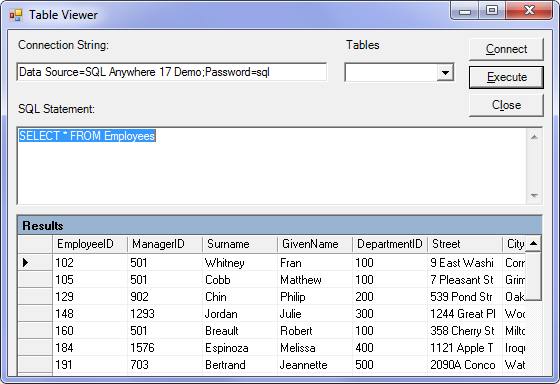

<!-- loio3bcf8f286c5f10148de3e7702c087c65 -->

# Tutorial: Using the Table Viewer Code Sample

Use the TableViewer project as an example of how to connect to a database, execute SQL statements, and display the results using a DataGrid object using the .NET Data Provider.


## Prerequisites

You must have Microsoft Visual Studio and the Microsoft .NET Framework installed on your computer.

You must have the SELECT ANY TABLE system privilege.


## Context

The TableViewer project is included with the samples. The Table Viewer project is more complex than the Simple project. You can use it to connect to a database, select a table, and execute SQL statements on the database.


## Procedure

1.  Start Microsoft Visual Studio.

2.  Click *File* \> *Open* \> *Project*.

3.  Browse to <code><i>%IQDIRSAMP17%</i>\SQLAnywhere\ADO.NET\TableViewer</code> and open the `TableViewer.sln` project.

4.  To use the .NET Data Provider in a project, you must add a reference to the Data Provider DLL. This has already been done in the Table Viewer code sample. To view the reference to the Data Provider \(`Sap.Data.SQLAnywhere`\), open the *References* folder in the *Solution Explorer* window.

5.  You must also add a `using` directive to your source code to reference the Data Provider classes. This has already been done in the Table Viewer code sample. To view the `using` directive:

    -   Open the source code for the project. In the *Solution Explorer* window, right-click `TableViewer.cs` and click *View Code*.

    -   In the `using` directives in the top section, you see the following line:

        ```
        using Sap.Data.SQLAnywhere;
        ```

        This line is required for Microsoft C\# projects. If you are using Microsoft Visual Basic, add the equivalent `Imports` line to your source code.


6.  Click *Debug* \> *Start Without Debugging* or press Ctrl+F5 to run the Table Viewer sample.

    The application connects to the sample database.

7.  In the *Table Viewer* window, modify the *Connection String* text box and enter a valid database password for the HDLADMIN user. Click *Connect*.

8.  In the *Table Viewer* window, click *Execute*.

    The application retrieves the data from the Employees table in the sample database and puts the query results in the *Results* datagrid, as follows:

    

    You can also execute other SQL statements from this application: type a SQL statement in the *SQL Statement* pane, and then click *Execute*.

9.  Close the *Table Viewer* window to shut down the application and disconnect from the sample database. This also shuts down the database server.


## Results

You have built and executed a Microsoft .NET application that uses the .NET Data Provider to connect to a database, execute SQL statements, and display the results using a DataGrid object.


The complete application can be found in the samples directory at <code><i>%IQDIRSAMP17%</i>\SQLAnywhere\ADO.NET\TableViewer</code>.

