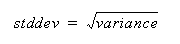

<!-- loio0dde65ab55a549d3b058038134cae149 -->

# STDDEV Function for Data Lake Relational Engine \(SAP HANA DB-Managed\)

Returns the standard deviation of a set of numbers.


```
STDDEV ( [ ALL ] <expression> )
```


<a name="loio0dde65ab55a549d3b058038134cae149__section_cqh_gv5_vrb"/>

## Parameters

 *<expression\>*
 :   Any numeric data type \(FLOAT, REAL, or DOUBLE precision\) expression.

 

<a name="loio0dde65ab55a549d3b058038134cae149__section_krv_gv5_vrb"/>

## Returns

DOUBLE


<a name="loio0dde65ab55a549d3b058038134cae149__section_y5f_hv5_vrb"/>

## Remarks

The formula used to calculate `STDDEV` is:



`STDDEV` returns a result of data type `DOUBLE` precision floating-point. If applied to the empty set, the result is NULL, which returns NULL for a one-element input set.

`STDDEV` does not support the keyword DISTINCT. A syntax error is returned if you use DISTINCT with `STDDEV`.


<a name="loio0dde65ab55a549d3b058038134cae149__section_pxn_3v5_vrb"/>

## Standards and Compatibility

-   SQL – vendor extension to ISO/ANSI SQL grammar
-   SAP database products – not supported by SAP Adaptive Server Enterprise


<a name="loio0dde65ab55a549d3b058038134cae149__section_ic3_jv5_vrb"/>

## Example

-   Given this data:

    ```
    SELECT Salary FROM Employees WHERE DepartmentID = 300
    ```


    <table>
    <tr>
    <th valign="top" rowspan="1">

          Salary


    
    </th>
    </tr>
    <tr>
    <td valign="top" rowspan="1">

     51432.000


    
    </td>
    </tr>
    <tr>
    <td valign="top" rowspan="1">

     57090.000


    
    </td>
    </tr>
    <tr>
    <td valign="top" rowspan="1">

     42300.000


    
    </td>
    </tr>
    <tr>
    <td valign="top" rowspan="1">

       43700.00


    
    </td>
    </tr>
    <tr>
    <td valign="top" rowspan="1">

      36500.000


    
    </td>
    </tr>
    <tr>
    <td valign="top" rowspan="1">

    138948.000


    
    </td>
    </tr>
    <tr>
    <td valign="top" rowspan="1">

      31200.000


    
    </td>
    </tr>
    <tr>
    <td valign="top" rowspan="1">

        58930.00


    
    </td>
    </tr>
    <tr>
    <td valign="top" rowspan="1">

        75400.00


    
    </td>
    </tr>
    </table>
    
    The following statement returns the value 32617.8446712838471:

    ```
    SELECT STDDEV ( Salary ) FROM Employees
    WHERE DepartmentID = 300
    ```

-   Given this data:

    ```
    SELECT UnitPrice FROM Products WHERE Name = 'Tee Shirt'
    ```


    <table>
    <tr>
    <th valign="top" rowspan="1">

    Name


    
    </th>
    <th valign="top" rowspan="1">

    UnitPrice


    
    </th>
    </tr>
    <tr>
    <td valign="top" rowspan="1">

    Tee Shirt


    
    </td>
    <td valign="top" rowspan="1">

                9.00


    
    </td>
    </tr>
    <tr>
    <td valign="top" rowspan="1">

    Tee Shirt


    
    </td>
    <td valign="top" rowspan="1">

              14.00


    
    </td>
    </tr>
    <tr>
    <td valign="top" rowspan="1">

    Tee Shirt


    
    </td>
    <td valign="top" rowspan="1">

              14.00


    
    </td>
    </tr>
    </table>
    
    The following statement returns the value 2.88675134594813049:

    ```
    SELECT STDDEV ( UnitPrice ) FROM Products
    WHERE Name = 'Tee Shirt'
    ```


**Related Information**  


[STDDEV_POP Function [Aggregate] for Data Lake Relational Engine](https://help.sap.com/viewer/19b3964099384f178ad08f2d348232a9/2023_1_QRC/en-US/a583f35984f21015b952ffc0a8c12597.html "Computes the standard deviation of a population consisting of a numeric-expression, as a DOUBLE.") :arrow_upper_right:

