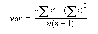

<!-- loio974f709b109d4fb1bfe049dc4b05d7de -->

# VARIANCE Function for Data Lake Relational Engine \(SAP HANA DB-Managed\)

Returns the variance of a set of numbers.


```
VARIANCE ( [ ALL ] <expression> );
```


<a name="loio974f709b109d4fb1bfe049dc4b05d7de__section_s1m_t2v_vrb"/>

## Parameters


<dl>
<dt><b>

*<expression\>*

</b></dt>
<dd>

Any numeric data type \(`FLOAT`, `REAL`, or `DOUBLE`\) expression.

The expression \(commonly a column name\) whose sample-based variance is calculated over a set of rows.


</dd>
</dl>


<a name="loio974f709b109d4fb1bfe049dc4b05d7de__section_rxb_52v_vrb"/>

## Result Set

DOUBLE


<a name="loio974f709b109d4fb1bfe049dc4b05d7de__section_i5n_52v_vrb"/>

## Remarks

The formula used to calculate `VARIANCE` is



`VARIANCE` returns a result of data type `double-precision floating-point`. If applied to the empty set, the result is NULL, which returns NULL for a one-element input set.

`VARIANCE` does not support the keyword DISTINCT. A syntax error is returned if DISTINCT is used with `VARIANCE`.


<a name="loio974f709b109d4fb1bfe049dc4b05d7de__section_srl_v2v_vrb"/>

## Standards and Compatibility

-   SQL – vendor extension to ISO/ANSI SQL grammar
-   SAP database products – not supported by SAP Adaptive Server Enterprise


<a name="loio974f709b109d4fb1bfe049dc4b05d7de__section_mcc_w2v_vrb"/>

## Examples

-   Given this data:

    ```
    SELECT Salary FROM Employees WHERE DepartmentID = 300;
    ```


    <table>
    <tr>
    <th valign="top" rowspan="1">

          salary
    
    </th>
    </tr>
    <tr>
    <td valign="top" rowspan="1">
    
     51432.000
    
    </td>
    </tr>
    <tr>
    <td valign="top" rowspan="1">
    
     57090.000
    
    </td>
    </tr>
    <tr>
    <td valign="top" rowspan="1">
    
     42300.000
    
    </td>
    </tr>
    <tr>
    <td valign="top" rowspan="1">
    
       43700.00
    
    </td>
    </tr>
    <tr>
    <td valign="top" rowspan="1">
    
      36500.000
    
    </td>
    </tr>
    <tr>
    <td valign="top" rowspan="1">
    
    138948.000
    
    </td>
    </tr>
    <tr>
    <td valign="top" rowspan="1">
    
      31200.000
    
    </td>
    </tr>
    <tr>
    <td valign="top" rowspan="1">
    
        58930.00
    
    </td>
    </tr>
    <tr>
    <td valign="top" rowspan="1">
    
        75400.00
    
    </td>
    </tr>
    </table>
    
    The following statement returns the value 1063923790.99999994:

    ```
    SELECT VARIANCE ( Salary ) FROM Employees
    WHERE DepartmentID = 300;
    ```

-   Given this data:

    ```
    SELECT UnitPrice FROM Products WHERE name = 'Tee Shirt';
    ```


    <table>
    <tr>
    <th valign="top" rowspan="1">

    UnitPrice
    
    </th>
    </tr>
    <tr>
    <td valign="top" rowspan="1">
    
                9.00
    
    </td>
    </tr>
    <tr>
    <td valign="top" rowspan="1">
    
              14.00
    
    </td>
    </tr>
    <tr>
    <td valign="top" rowspan="1">
    
              14.00
    
    </td>
    </tr>
    </table>
    
    The following statement returns the value 8.33333333333334327:

    ```
    SELECT VARIANCE ( UnitPrice ) FROM Products
    WHERE name = 'Tee Shirt';
    ```


**Related Information**  


[VARIANCE Function \[Aggregate\] for Data Lake Relational Engine](https://help.sap.com/viewer/19b3964099384f178ad08f2d348232a9/2024_1_QRC/en-US/a58fdc8684f210158b82f182e03b637a.html "Returns the variance of a set of numbers.") :arrow_upper_right:

