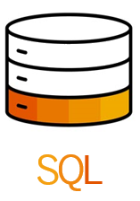

<!-- loio74814c5dca454066804e5670fa2fe4f5 -->

# SAP HANA Cloud, Data Lake SQL Reference for Data Lake Relational Engine \(SAP HANA DB-Managed\)

This document provides reference information for SQL syntax unique to the data lake Relational Engine layer of SAP HANA database.

The data lake Relational Engine layer of SAP HANA database uses SQL syntax derived from on-premise SAP IQ. When communicating with the data lake Relational Engine layer, you use data lake Relational Engine syntax, not SAP HANA database syntax. For example, the select statement for querying the SAP HANA database layer \( [SELECT Statement for SAP HANA Database](080-sap-hana-database-for-data-lake-relational-engine/select-statement-for-sap-hana-database-68b8472.md)\) isn’t the same as the select statement for querying the data lake Relational Engine relational container \([SELECT Statement for Data Lake Relational Engine \(SAP HANA DB-Managed\)](030-sql-statements/select-statement-for-data-lake-relational-engine-sap-hana-db-managed-7123f8b.md)\).

As a convenience, this document includes some SAP HANA database SQL syntax specially customized for integrated data lake Relational Engine users. For example, [CREATE VIRTUAL TABLE Statement for SAP HANA Database](080-sap-hana-database-for-data-lake-relational-engine/create-virtual-table-statement-for-sap-hana-database-e60ebf8.md) and [GRANT Statement for SAP HANA Database](080-sap-hana-database-for-data-lake-relational-engine/grant-statement-for-sap-hana-database-ee1648d.md), and other SAP HANA database SQL commands you use frequently as a data lake Relational Engine user, are documented in this guide.

<a name="loio74814c5dca454066804e5670fa2fe4f5__section_bv2_hyf_n1b"/>

## Data lake Relational Engine \(SAP HANA DB-Managed\) SQL

Click the icon to open the section for Data lake Relational Engine \(SAP HANA DB-Managed\) syntax.

<a name="loio74814c5dca454066804e5670fa2fe4f5__section_xhx_zxf_n1b"/>

## SAP HANA Database SQL

Click this icon to open the section for SAP HANA database syntax optimized for data lake Relational Engine users.

<a name="loio74814c5dca454066804e5670fa2fe4f5__section_jbp_3bp_wnb"/>

## Audience

This guide is for SAP HANA database users with an integrated data lake Relational Engine \(SAP HANA DB-Managed\). If your data lake Relational Engine is not integrated – then guide isn’t the correct SQL reference guide for you. See [SAP HANA Cloud, Data Lake SQL Reference for Data Lake Relational Engine](https://help.sap.com/viewer/19b3964099384f178ad08f2d348232a9/2023_1_QRC/en-US/7b5bd4e8cdcb4593aba6f2895572b0a9.html "This reference guide describes the SQL functions, procedures, tables, views, statements, and options used by data lake Relational Engine.") :arrow_upper_right: instead. A nonintegrated data lake Relational Engine gives you more SQL permissions, and therefore the [SAP HANA Cloud, Data Lake SQL Reference for Data Lake Relational Engine](https://help.sap.com/viewer/19b3964099384f178ad08f2d348232a9/2023_1_QRC/en-US/7b5bd4e8cdcb4593aba6f2895572b0a9.html "This reference guide describes the SQL functions, procedures, tables, views, statements, and options used by data lake Relational Engine.") :arrow_upper_right: guide contains more reference topics than this guide.

