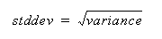

<!-- loioa583716084f2101595c8e7a0abc4d989 -->

# STDDEV Function \[Aggregate\] for Data Lake Relational Engine

Returns the standard deviation of a set of numbers.


```
STDDEV ( [ ALL ] <expression> )
```


<a name="loioa583716084f2101595c8e7a0abc4d989__STDDEV_parm1"/>

## Parameters


<dl>
<dt><b>

*<expression\>*

</b></dt>
<dd>

Any numeric data type \(FLOAT, REAL, or DOUBLE precision\) expression.


</dd>
</dl>


<a name="loioa583716084f2101595c8e7a0abc4d989__STDDEV_returns1"/>

## Returns

DOUBLE


<a name="loioa583716084f2101595c8e7a0abc4d989__STDDEV_remarks1"/>

## Remarks

The formula used to calculate `STDDEV` is:



`STDDEV` returns a result of data type `DOUBLE` precision floating-point. If applied to the empty set, the result is NULL, which returns NULL for a one-element input set.

`STDDEV` does not support the keyword DISTINCT. A syntax error is returned if you use DISTINCT with `STDDEV`.


<a name="loioa583716084f2101595c8e7a0abc4d989__STDDEV_standards1"/>

## Standards and Compatibility

-   SQL – vendor extension to ISO/ANSI SQL grammar
-   SAP database products – not supported by SAP Adaptive Server Enterprise


<a name="loioa583716084f2101595c8e7a0abc4d989__STDDEV_example1"/>

## Example

-   Given this data:

    ```
    SELECT Salary FROM Employees WHERE DepartmentID = 300
    ```


    <table>
    <tr>
    <th valign="top" rowspan="1">

          Salary


    
    </th>
    </tr>
    <tr>
    <td valign="top" rowspan="1">
    
         51432.000


    
    </td>
    </tr>
    <tr>
    <td valign="top" rowspan="1">
    
         57090.000


    
    </td>
    </tr>
    <tr>
    <td valign="top" rowspan="1">
    
         42300.000


    
    </td>
    </tr>
    <tr>
    <td valign="top" rowspan="1">
    
           43700.00


    
    </td>
    </tr>
    <tr>
    <td valign="top" rowspan="1">
    
          36500.000


    
    </td>
    </tr>
    <tr>
    <td valign="top" rowspan="1">
    
        138948.000


    
    </td>
    </tr>
    <tr>
    <td valign="top" rowspan="1">
    
          31200.000


    
    </td>
    </tr>
    <tr>
    <td valign="top" rowspan="1">
    
            58930.00


    
    </td>
    </tr>
    <tr>
    <td valign="top" rowspan="1">
    
            75400.00


    
    </td>
    </tr>
    </table>
    
    The following statement returns the value 32617.8446712838471:

    ```
    SELECT STDDEV ( Salary ) FROM Employees
    WHERE DepartmentID = 300
    ```

-   Given this data:

    ```
    SELECT UnitPrice FROM Products WHERE Name = 'Tee Shirt'
    ```


    <table>
    <tr>
    <th valign="top" rowspan="1">

    Name


    
    </th>
    <th valign="top" rowspan="1">

    UnitPrice


    
    </th>
    </tr>
    <tr>
    <td valign="top" rowspan="1">
    
        Tee Shirt


    
    </td>
    <td valign="top" rowspan="1">
    
                    9.00


    
    </td>
    </tr>
    <tr>
    <td valign="top" rowspan="1">
    
        Tee Shirt


    
    </td>
    <td valign="top" rowspan="1">
    
                  14.00


    
    </td>
    </tr>
    <tr>
    <td valign="top" rowspan="1">
    
        Tee Shirt


    
    </td>
    <td valign="top" rowspan="1">
    
                  14.00


    
    </td>
    </tr>
    </table>
    
    The following statement returns the value 2.88675134594813049:

    ```
    SELECT STDDEV ( UnitPrice ) FROM Products
    WHERE Name = 'Tee Shirt'
    ```


**Related Information**  


[Windowing Aggregate Function Usage in Data Lake Relational Engine](windowing-aggregate-function-usage-in-data-lake-relational-engine-a527f35.md "A major feature of the ISO/ANSI SQL extensions for OLAP is a construct called a window.")

[STDDEV Function for Data Lake Relational Engine (SAP HANA DB-Managed)](https://help.sap.com/viewer/a898e08b84f21015969fa437e89860c8/2023_2_QRC/en-US/0dde65ab55a549d3b058038134cae149.html "Returns the standard deviation of a set of numbers.") :arrow_upper_right:

