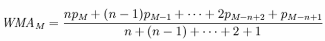

<!-- loioa590e30584f210158df8d2242a037242 -->

# WEIGHTED\_AVG Function \[Aggregate\] for Data Lake Relational Engine

Calculates an arithmetically \(or linearly\) weighted average.


```
WEIGHTED_AVG (<expression>) OVER (<window-spec>);
```


<a name="loioa590e30584f210158df8d2242a037242__WEIGHTED_AVG_parm1"/>

## Parameters


<dl>
<dt><b>

*<expression\>*

</b></dt>
<dd>

A numeric expression for which a weighted value is being computed.


</dd><dt><b>

*<window-spec\>*

</b></dt>
<dd>

Specified when using this function as a window function.


</dd>
</dl>


<a name="loioa590e30584f210158df8d2242a037242__WEIGHTED_AVG_remarks1"/>

## Remarks

A weighted average is an average in which each quantity to be averaged is assigned a weight. Weightings determine the relative importance of each quantity that make up the average.

Use the `WEIGHTED_AVG` function to create a weighted moving average. In a weighted moving average, weights decrease arithmetically over time. Weights decrease from the highest weight for the most recent data points, down to zero.

  
  
**WEIGHTED\_AVG Calculation**



To exaggerate the weighting, you can average two or more weighted moving averages together, or use an `EXP_WEIGHTED_AVG` function instead.

The *<window-spec\>* parameter represents usage as a window function in a `SELECT` statement. As such, you can specify elements of *<window-spec\>* either in the function syntax \(inline\), or with a `WINDOW` clause in the `SELECT` statement.

-   Must contain an ORDER BY specifier.
-   Cannot contain FOLLOWING or RANGE specifiers.
-   The second argument of the ROW specifier — if provided — must be CURRENT ROW.
-   Cannot contain NULL values.
-   Cannot contain the DISTINCT specifier.
-   UNBOUNDED PRECEDING is supported, but may result in poor performance if used


<a name="loioa590e30584f210158df8d2242a037242__WEIGHTED_AVG_standards1"/>

## Standards and Compatibility

-   SQL – vendor extension to ISO/ANSI SQL grammar


<a name="loioa590e30584f210158df8d2242a037242__WEIGHTED_AVG_example1"/>

## Example

The following example returns a weighted average of salaries by department for employees in Florida, with the salary of recently hired employees contributing the most weight to the average:

```
SELECT DepartmentID, Surname, Salary,
WEIGHTED_AVG(Salary) OVER (PARTITION BY DepartmentID
ORDER BY YEAR(StartDate) DESC) as "W_AVG"
FROM Employees
WHERE State IN ('FL') ORDER BY DepartmentID;
```

The returned result set is:


<table>
<tr>
<th valign="top" rowspan="1">

DepartmentID

</th>
<th valign="top" rowspan="1">

Surname

</th>
<th valign="top" rowspan="1">

Salary

</th>
<th valign="top" rowspan="1">

W\_AVG

</th>
</tr>
<tr>
<td valign="top" rowspan="1">

100

</td>
<td valign="top" rowspan="1">

Lull

</td>
<td valign="top" rowspan="1">

87,900.000

</td>
<td valign="top" rowspan="1">

87,900.000000

</td>
</tr>
<tr>
<td valign="top" rowspan="1">

100

</td>
<td valign="top" rowspan="1">

Gowda

</td>
<td valign="top" rowspan="1">

59,840.000

</td>
<td valign="top" rowspan="1">

69,193.333333

</td>
</tr>
<tr>
<td valign="top" rowspan="1">

200

</td>
<td valign="top" rowspan="1">

Sterling

</td>
<td valign="top" rowspan="1">

64,900.000

</td>
<td valign="top" rowspan="1">

64,900.000000

</td>
</tr>
<tr>
<td valign="top" rowspan="1">

200

</td>
<td valign="top" rowspan="1">

Kelly

</td>
<td valign="top" rowspan="1">

87,500.000

</td>
<td valign="top" rowspan="1">

79,966.666667

</td>
</tr>
<tr>
<td valign="top" rowspan="1">

300

</td>
<td valign="top" rowspan="1">

Litton

</td>
<td valign="top" rowspan="1">

58,930.000

</td>
<td valign="top" rowspan="1">

58,930.000000

</td>
</tr>
<tr>
<td valign="top" rowspan="1">

400

</td>
<td valign="top" rowspan="1">

Evans

</td>
<td valign="top" rowspan="1">

68,940.000

</td>
<td valign="top" rowspan="1">

68,940.000000

</td>
</tr>
<tr>
<td valign="top" rowspan="1">

400

</td>
<td valign="top" rowspan="1">

Charlton

</td>
<td valign="top" rowspan="1">

28,300.000

</td>
<td valign="top" rowspan="1">

41,846.666667

</td>
</tr>
<tr>
<td valign="top" rowspan="1">

400

</td>
<td valign="top" rowspan="1">

Francis

</td>
<td valign="top" rowspan="1">

53,870.000

</td>
<td valign="top" rowspan="1">

47,858.333333

</td>
</tr>
</table>

**Related Information**  


[Windowing Aggregate Function Usage in Data Lake Relational Engine](windowing-aggregate-function-usage-in-data-lake-relational-engine-a527f35.md "A major feature of the ISO/ANSI SQL extensions for OLAP is a construct called a window.")

[EXP\_WEIGHTED\_AVG Function \[Aggregate\] for Data Lake Relational Engine](exp-weighted-avg-function-aggregate-for-data-lake-relational-engine-a551b4f.md "Calculates an exponential weighted moving average. Weightings determine the relative importance of each quantity that makes up the average.")

[WEIGHTED_AVG Function for Data Lake Relational Engine (SAP HANA DB-Managed)](https://help.sap.com/viewer/a898e08b84f21015969fa437e89860c8/2023_4_QRC/en-US/7a370d0d94cb4061a4de45b28ddbac36.html "Calculates an arithmetically (or linearly) weighted average.") :arrow_upper_right:

